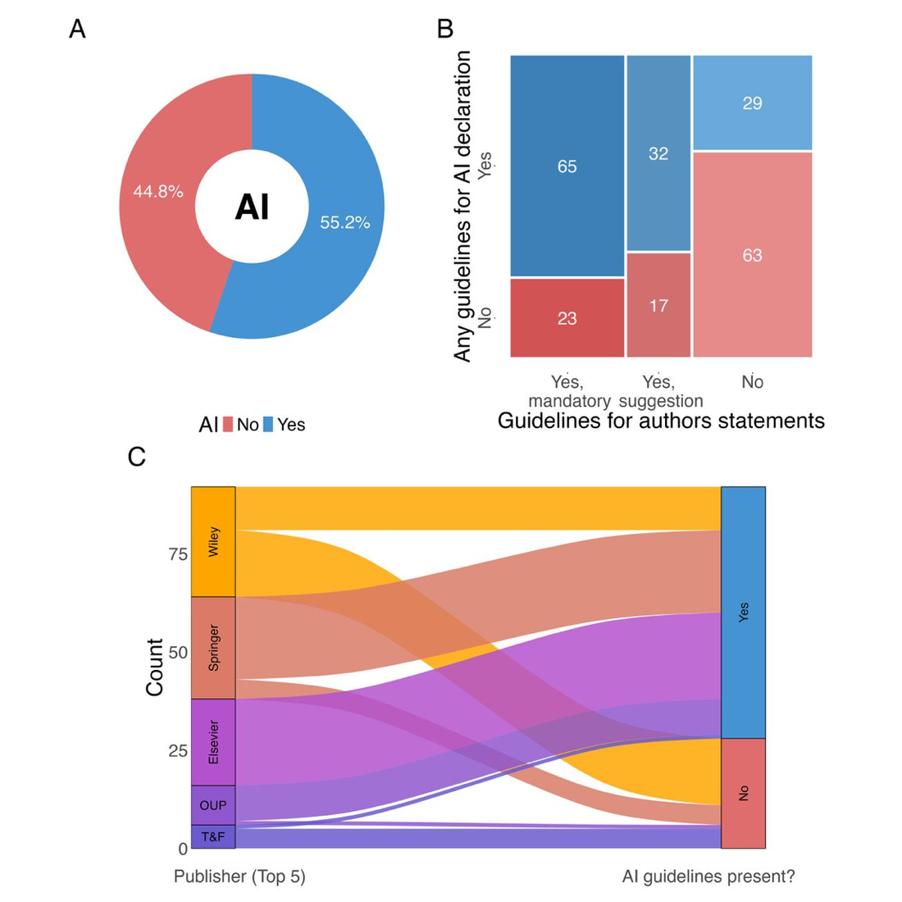
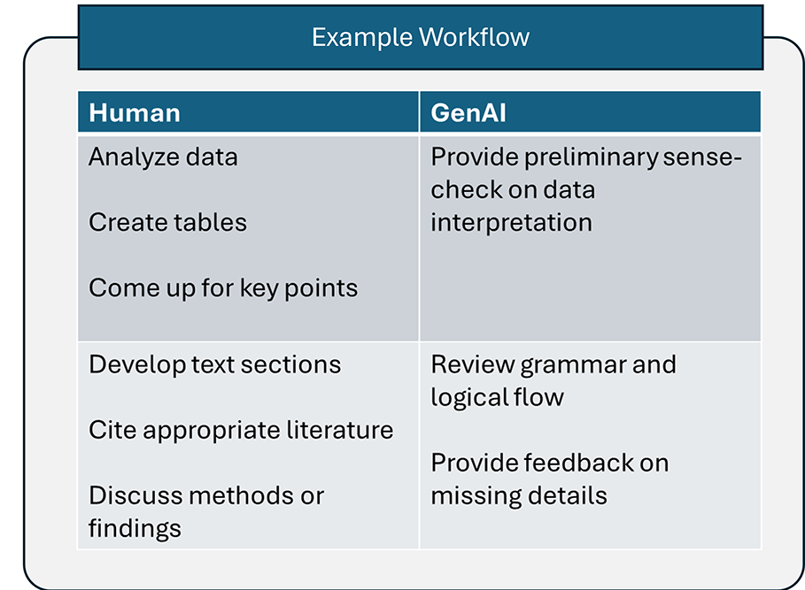
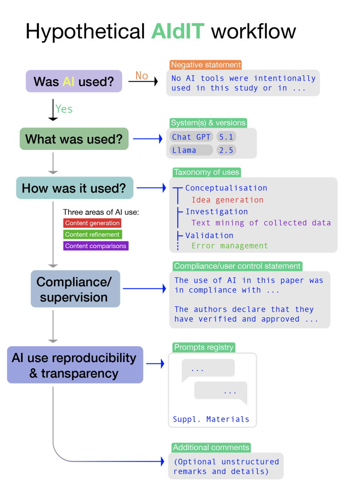
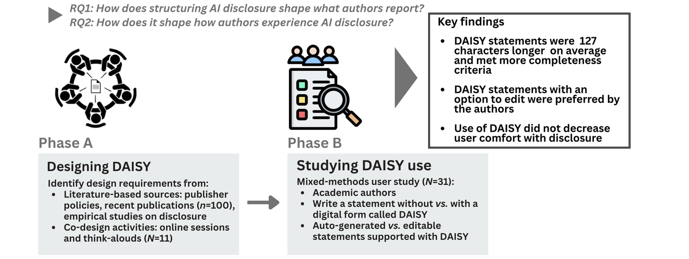

## Roteiro {.smaller}

::: {.bsl-destaque}
**Pergunta-guia:** o problema não é *se* usamos IA generativa, é *como* usamos e *como reportamos*.
:::

0. O cenário: mais submissões, menos tempo de revisão
1. Ética: por que autoria e responsabilidade não se delegam
2. As regras das cinco maiores editoras
3. A Portaria CNPq nº 2.664/2026
4. A posição do COPE
5. Limites dos LLMs e cuidados ao gerar texto científico
6. Boas práticas de reporte: o framework AIdIT

::: {.fonte}
Slides, código e referências: github.com/diogoprov
:::

# 0 · O cenário {.bsl-secao background-color="#f3eee3"}

## O volume de submissões explodiu {.smaller}

::: {.columns}
::: {.column width="33%"}
[+33%]{.numero}
[submissões no 1º trimestre de 2026 vs. 2025 (plataforma ScholarOne)]{.numero-legenda}
:::
::: {.column width="33%"}
[17% → 33%]{.numero}
[a taxa de crescimento **dobrou** de 2025 para 2026]{.numero-legenda}
:::
::: {.column width="33%"}
[+81%]{.numero}
[em periódicos pequenos (&lt;15 submissões/trimestre); grandes cresceram 20%]{.numero-legenda}
:::
:::

::: {.bsl-destaque}
O crescimento é **assimétrico**: bate mais forte em quem tem menos estrutura editorial para absorver.
:::

::: {.fonte}
Dados da plataforma ScholarOne Manuscripts, compilados em *The Scholarly Kitchen* (13/05/2026): <https://scholarlykitchen.sspnet.org/2026/05/13/guest-post-is-growth-always-good-news-2026-article-submission-surges/>
:::

## E a triagem editorial acompanhou {.smaller}

- Entre 2022 e 2025, as **desk rejections cresceram 72%** — quase o dobro do crescimento de 43% no total de decisões editoriais.
- A razão passou de **1,69 desk rejection por aceite (2022)** para **2,49 (2025)**.

::: {.bsl-destaque}
**Leitura de quem está do outro lado:** o gargalo deixou de ser o parecerista. Passou a ser o tempo do editor para decidir o que sequer entra em revisão.
:::

::: {.fonte}
Mesma fonte (ScholarOne / *The Scholarly Kitchen*, 2026). O autor é explícito: o padrão "é consistente com crescimento legítimo", mas também é "o padrão que se esperaria se parte relevante da alta refletisse submissões de baixo esforço, assistidas por IA".
:::

## A mesma curva, vista da mesa do editor {.smaller}

No *Information Systems Journal*, os editores relatam que **receber 20 submissões novas por dia virou normal**; a taxa de desk rejection passou de **60%** e a de aceite caiu a **4%**. A conferência ICIS 2026 recebeu **72,6% mais submissões** que a de 2025.

No *FEBS Journal*, o editor-chefe descreve o mesmo quadro do outro lado: o esforço para separar as submissões problemáticas cresceu a ponto de consumir o tempo que deveria ir para a ciência.

::: {.bsl-destaque}
**Mas cuidado com a inferência.** Os próprios editores do ISJ escrevem que *suspeitam* que boa parte dessas submissões foi feita com IA generativa — é suspeita declarada, não medição. E Jamali et al. (2025), entrevistando 27 editores, encontram outra explicação para a falta de revisores: carga de trabalho acadêmica e universidades que tiraram a revisão por pares dos modelos de alocação de horas.
:::

A IA generativa não chegou a um sistema saudável. Chegou a um que já estava sob tensão.

::: {.fonte}
Davison RM et al. (2026). Information Systems Journal. doi:10.1111/isj.70055 · Martin SJ (2026). FEBS J 293:5–9. doi:10.1111/febs.70388 · Jamali HR, Wakeling S, Luca EJ (2025). Learned Publishing 39(1). doi:10.1002/leap.2034
:::

## Quanto do texto publicado já passa por LLM? {.smaller}

Kobak et al. (2025) analisaram **mais de 15 milhões de resumos do PubMed (2010–2024)** e mediram a mudança abrupta na frequência de palavras de estilo ("excess vocabulary").

> "This excess word analysis suggests that at least 13.5% of 2024 abstracts were processed with LLMs. This lower bound differed across disciplines, countries, and journals, reaching 40% for some subcorpora."

::: {.bsl-destaque}
**13,5% é um piso, não uma estimativa central.** E é uma assinatura *estilística* — não é uma acusação de má conduta.
:::

::: {.fonte}
Kobak D, González-Márquez R, Horvát E-Á, Lause J. *Delving into LLM-assisted writing in biomedical publications through excess vocabulary*. Science Advances (2025). doi:10.1126/sciadv.adt3813 · preprint: arXiv:2406.07016
:::

## O pano de fundo: integridade sob pressão {.smaller}

- Em 2023, o número de retratações **ultrapassou 10.000 em um único ano** — recorde histórico, puxado por *paper mills* e fraude em revisão por pares.
- Especialistas em integridade citados pela *Nature* tratam o número como "a ponta do iceberg".

::: {.bsl-destaque}
IA generativa não criou o problema das *paper mills*. Mas **baixou drasticamente o custo marginal** de produzir um manuscrito plausível.
:::

::: {.fonte}
Van Noorden R (2023). *More than 10,000 research papers were retracted in 2023 — a new record*. Nature 624:479–481. <https://www.nature.com/articles/d41586-023-03974-8>
:::

## E na nossa área? Ecologia e evolução {.smaller}

::: {.columns}
::: {.column width="52%"}
Drobniak et al. (2026) mapearam **230 periódicos de ecologia e biologia evolutiva** e auditaram artigos publicados:

- **45% (103/230) não têm nenhuma orientação** sobre uso de IA — nem uma menção.
- Onde há política, ela é quase sempre **genérica e herdada da editora**, não do periódico.
- **Menos de 6% dos artigos** declaram uso de IA — mesmo em periódicos com política formal.
- Periódicos da **mesma editora divergem entre si** (painel C).

::: {.fonte}
Drobniak SM et al. *A systematic map of generative AI guidelines and reporting in ecology and evolutionary biology: towards the framework of AI disclosure for Improved Transparency (AIdIT)*. Research Integrity and Peer Review (2026). doi:10.1186/s41073-026-00230-1
:::
:::
::: {.column width="48%"}
::: {.bsl-fig .bsl-fig-alta}
{fig-alt="Figura 1 de Drobniak et al. 2026: A, proporção de periódicos com e sem diretrizes de IA; B, sobreposição com diretrizes de contribuição de autoria; C, diagrama aluvial por editora."}
:::

::: {.credito}
Fig. 1 de Drobniak et al. (2026), Res Integr Peer Rev, doi:10.1186/s41073-026-00230-1. Reproduzida sem alterações sob CC BY-NC-ND 4.0.
:::
:::
:::

## O diagnóstico em uma frase {.smaller}

::: {.bsl-destaque}
Existe um **abismo entre princípio e prática**: todo mundo concorda que se deve declarar, quase ninguém declara — e as políticas não dizem *como* declarar.
:::

- Ter política ajuda, mas pouco: **7% de declaração** em periódicos com política vs. **4%** sem política (χ² = 10,1; gl = 1; p = 0,001).
- Text mining de **124 documentos** de diretrizes: mediana de **252 palavras** (amplitude 149–11.766), linguagem padronizada, precaucionária, centrada em proibição e responsabilidade — com **orientação operacional mínima** sobre usos aceitáveis e formatos de declaração.
- Em **ornitologia**, o retrato é o mesmo: dos 20 periódicos de maior impacto, **12 têm política de IA generativa e 8 não têm orientação localizável** — e a área fica atrás de outras disciplinas na formulação dessas políticas.

::: {.fonte}
Drobniak et al. (2026), doi:10.1186/s41073-026-00230-1 · McClure CJW (2026). *Generative-AI policies vary widely across top ornithology journals*. Ibis 168:1159–1163. doi:10.1111/ibi.70054
:::

# 1 · Ética {.bsl-secao background-color="#f3eee3"}

## Por que um LLM não pode ser autor {.smaller}

Não é uma questão de mérito intelectual. É uma questão de **imputabilidade**:

- Autoria implica **prestar contas** pelo conteúdo — inclusive em retratação.
- Autoria implica **declarar (ou negar) conflitos de interesse**.
- Autoria implica **assinar cessão de direitos e licenças**.

> "AI tools cannot meet the requirements for authorship as they cannot take responsibility for the submitted work. As non-legal entities, they cannot assert the presence or absence of conflicts of interest nor manage copyright and license agreements." — COPE

::: {.fonte}
COPE, *Authorship and AI tools* (posição revisada em 13/02/2023; versão 1 publicada em 20/08/2024): <https://publicationethics.org/guidance/cope-position/authorship-and-ai-tools>
:::

## As quatro obrigações que permanecem suas {.smaller}

1. **Veracidade** — cada afirmação e cada referência precisa existir e dizer o que você diz que diz.
2. **Originalidade** — texto gerado e não reescrito é, na melhor hipótese, plágio de ninguém; na pior, plágio de alguém.
3. **Transparência** — o leitor precisa conseguir separar o que é julgamento humano do que foi delegado.
4. **Confidencialidade** — manuscrito sob revisão e dados não publicados não são seus para alimentar um modelo de terceiros.

::: {.bsl-destaque}
"Authors are fully responsible for the content of their manuscript, even those parts produced by an AI tool, and are thus liable for any breach of publication ethics." (COPE)
:::

## Quem faz o quê {.smaller}

::: {.columns}
::: {.column width="47%"}
Um fluxo de trabalho proposto para preparação de artigos: a IA entra como **conferência e polimento**, nunca como origem do conteúdo ou do julgamento.

::: {.bsl-destaque}
Repare na assimetria: tudo que exige **responder pelo resultado** — analisar, citar, discutir — fica do lado humano.
:::

::: {.fonte}
White RR (2025). *Generative artificial intelligence tools in journal article preparation: a preliminary catalog of ethical considerations, opportunities, and pitfalls*. JDS Communications 6:452–457. doi:10.3168/jdsc.2024-0707
:::
:::
::: {.column width="53%"}
::: {.bsl-fig}
{fig-alt="Tabela de exemplo de fluxo de trabalho: coluna Human com analisar dados, criar tabelas, levantar pontos-chave, escrever seções, citar literatura, discutir métodos; coluna GenAI com conferência preliminar da interpretação dos dados, revisão de gramática e fluxo lógico, apontar detalhes faltantes."}
:::

::: {.credito}
Recorte do resumo gráfico de White (2025), JDS Communications, doi:10.3168/jdsc.2024-0707, sob CC BY 4.0.
:::
:::
:::

## O problema de equidade tem dois lados {.smaller}

**A favor do uso:** para quem não é falante nativo de inglês, LLMs reduzem uma barreira linguística real e documentada — e essa barreira sempre foi um filtro injusto na ciência.

**Contra o uso acrítico:** as ferramentas herdam e amplificam vieses do corpus.

> "AI Technologies do not have access to up-to-date subscription or paywalled journal content by default. As a result, they may overrepresent open access literature and general web content while underrepresenting research published in hybrid and subscription journals." — Wiley

::: {.bsl-destaque}
Para nós, no Sul global: a ferramenta que derruba a barreira do idioma pode, ao mesmo tempo, **estreitar a literatura que você enxerga**.
:::

::: {.fonte}
Wiley, *Using AI tools in your research* (2026). · Park J. *Towards a transparent and reproducible AI-assisted research paper writing*. Genomics & Informatics 23:26 (2025). doi:10.1186/s44342-025-00057-0
:::

## O custo invisível: o treinamento de quem está começando {.smaller}

> Um LLM "can be used to write and replace critical thinking and thorough literature reviews to the detriment of the user. In the case of students, the writing of their first manuscripts is a transformative training experience. Over-reliance on these language bots deprives them of this opportunity, limiting their intellectual growth and confidence."

::: {.bsl-destaque}
Escrever o primeiro artigo **é** o método de formação. Terceirizar essa etapa não economiza tempo do aluno — economiza a formação dele.
:::

::: {.fonte}
*Best Practices for Using AI When Writing Scientific Manuscripts* (Editorial). ACS Nano 17:4091–4093 (2023). doi:10.1021/acsnano.3c01544
:::

## "The machines are fine. I'm worried about us." {.smaller}

::: {.bsl-citacao}
"The grunt work *is* the work."
:::

::: {.bsl-citacao}
"You can't skip the first five years of learning and expect to survive the next twenty."
:::

::: {.bsl-citacao-fonte}
Minas Karamanis, *The machines are fine. I'm worried about us.* (30/03/2026) — <https://ergosphere.blog/posts/the-machines-are-fine/>
:::

::: {.bsl-destaque}
O argumento do ensaio: **o risco não é tecnológico, é institucional.** O que corrói a formação não é a ferramenta, e sim o sistema de incentivos que premia volume de publicação em vez de compreensão — a IA só tornou isso barato o bastante para ficar visível.
:::

Vale a pena ler inteiro. É a peça mais honesta que li sobre o assunto, e não é sobre IA: é sobre nós.

# 2 · As regras das editoras {.bsl-secao background-color="#f3eee3"}

## Por que estas cinco {.smaller}

Elsevier, Springer Nature, Wiley, Taylor & Francis e Sage concentram a maior parte do que publicamos.

> "Combined, the top five most prolific publishers account for more than 50% of all papers published in 2013." — Larivière, Haustein & Mongeon (2015)

Nas ciências naturais e médicas, essa fatia era de **53% em 2013**, contra cerca de **20% em 1973**.

::: {.bsl-destaque}
Consequência prática: **conhecer cinco políticas cobre a maior parte das suas submissões** — mas nunca dispensa ler as instruções do periódico específico.
:::

::: {.fonte}
Larivière V, Haustein S, Mongeon P. *The Oligopoly of Academic Publishers in the Digital Era*. PLoS ONE 10(6):e0127502 (2015). doi:10.1371/journal.pone.0127502
:::

## O quadro comparativo {.smaller}

| | IA como autor | Onde declarar | Revisão por pares |
|---|---|---|---|
| **Elsevier** | Não listar nem citar como autor | Seção própria: *Declaration of generative AI...* (texto padronizado) | Não subir manuscrito a ferramenta de IA; só ferramentas privadas, em apoio à linguagem |
| **Springer Nature** | Atribuir autoria/responsabilidade a IA é **vermelho** | Declaração transparente do uso | Pode usar como apoio, **sem** subir conteúdo a ferramentas públicas ou inseguras |
| **Wiley** | Direito autoral exige autoria humana | FAQ de *Disclosure and declaration of AI use* | Manuscrito sob revisão **não pode** ser subido, nem em parte |
| **Taylor & Francis** | Ver política de autoria | *Declaration of AI use statement* na submissão / metodologia | — |
| **Sage** | — | Métodos ou agradecimentos | Parecer gerado por GenAI: revisor não é mais convidado e o parecer é descartado |

::: {.fonte}
Páginas oficiais das editoras, consultadas em setembro de 2026 (links no slide de referências).
:::

## O ponto de convergência {.smaller}

As cinco concordam em três coisas:

1. **IA não é autor.** Sem exceção, sem nota de rodapé.
2. **Responsabilidade é integralmente humana** pelo conteúdo final, incluindo erros herdados da ferramenta.
3. **Manuscrito sob revisão é confidencial** — subir o PDF alheio num chatbot é violação de confidencialidade, não descuido.

::: {.bsl-destaque}
Onde elas **divergem** é justamente no que mais nos afeta no dia a dia: *o que precisa ser declarado*, *onde* e *com que nível de detalhe*.
:::

## Elsevier: o texto que você vai colar {.smaller}

**Título da seção:** Declaration of generative AI and AI-assisted technologies in the manuscript preparation process

> "During the preparation of this work, the author(s) used [NAME OF TOOL / SERVICE] in order to [REASON]. After using this tool/service, the author(s) reviewed and edited the content as needed and take(s) full responsibility for the content of the published article."

::: {.bsl-destaque}
Detalhe que muita gente erra: **"Basic checks of grammar, spelling and punctuation do not need a declaration statement."** Corretor ortográfico não é declaração de IA.
:::

::: {.fonte}
<https://www.elsevier.com/about/policies-and-standards/generative-ai-policies-for-journals>
:::

## Elsevier: figuras e imagens {.smaller}

- **Imagens explicativas:** permitidas — "The use of AI tools should be disclosed in the caption of each image".
- **Visualizações de dados:** só "when the visual output is directly derived from underlying data".
- **Dados primários:** "AI tools must not be used to create or alter images that represent primary observed or experimental data".
- **Abstract gráfico:** "General-purpose generative AI image tools must not be used to create graphical abstracts".

::: {.bsl-destaque}
Para nós: foto de espécime, radiografia, gel, prancha de girinos — **nada de "melhorar" com IA**. É evidência, não ilustração.
:::

## Wiley: a mesma linha, dita de outro jeito {.smaller}

- **Visualização de dados e ilustrações conceituais:** permitidas, com declaração e verificação.
- **Fotografias:** *não*.

> "Photographs in research manuscripts serve as evidence and artifacts of your research process. AI enhancement tools can introduce unintended alterations that compromise the reliability and reproducibility of your research evidence."

- Para ajustes legítimos: software convencional, edições **mínimas e uniformes** (contraste, cor).
- Analisar fotos por IA **como método** é permitido — e vai na seção de métodos.

::: {.fonte}
Wiley, *Using AI tools in your research* (2026): <https://www.wiley.com/publishing/article/ai-guidelines>
:::

## Springer Nature: o semáforo {.smaller}

::: {.columns}
::: {.column width="33%"}
[Verde]{.sem-verde} — *uso assistivo*

- polir ou refinar a linguagem
- sugerir estrutura/formatação
- traduzir ou clarificar comentários de revisor
- comparar opções metodológicas
- limpeza e deduplicação de dados
:::
::: {.column width="33%"}
[Âmbar]{.sem-ambar} — *uso avaliativo/interpretativo*

- sugerir abordagens analíticas ou experimentais
- redigir resumos explicativos
- comparar resultados com a literatura
- copidesque extensivo
- identificar padrões em análise exploratória
- recomendar testes estatísticos
:::
::: {.column width="33%"}
[Vermelho]{.sem-vermelho} — *IA substituindo julgamento*

- gerar hipóteses/análises/conclusões e apresentá-las como humanas
- fabricar dados, citações ou resultados
- razão central da pesquisa sem declaração
- atribuir autoria a IA
- delegar revisão por pares
- criar imagens fotorrealistas
:::
:::

::: {.fonte}
Nature Portfolio, *Artificial Intelligence (AI)*: <https://www.nature.com/nature-portfolio/editorial-policies/ai>
:::

## Taylor & Francis e Sage: o que muda {.smaller}

**Taylor & Francis** — a declaração deve conter:

- confirmação de que autores verificaram originalidade e exatidão do conteúdo;
- **nome e número da versão** da ferramenta;
- confirmação de que os termos de uso foram verificados;
- assunção integral de responsabilidade.

**Não exigem declaração:** copidesque e refino de linguagem, sugestões de gestão de referências, geração de ideias, apoio à programação.

**Sage** — exige declaração quando a IA produz conteúdo que "directly impacts the research methodology, analysis, results and/or conclusions". Ferramentas meramente assistivas (língua, gramática, estrutura) **não** exigem declaração. Local: métodos ou agradecimentos.

::: {.fonte}
<https://authorservices.taylorandfrancis.com/editorial-policies/using-ai-in-your-research-and-manuscript-preparations/> · <https://www.sagepub.com/journals/publication-ethics-policies/artificial-intelligence-policy>
:::

## Duas a mais que valem a pena conhecer {.smaller}

**Cambridge University Press** — três regras curtas:

> "AI use must be declared and clearly explained in publications such as research papers"; "AI and LLM tools may not be listed as an author on any scholarly work published by Cambridge"; "Authors are accountable for the accuracy, integrity and originality of their research papers, including for any use of AI".

**Oxford University Press** — é a única das sete com um **formulário próprio**: "Authors and Volume Editors should be sure to complete the **AI Use Declaration Form**". Também é a mais explícita sobre propriedade intelectual:

> "you must not upload any work you intend to publish with OUP, in full or in part, into any Gen AI tool that does not permit you to opt out of re-use or training in this way."

::: {.bsl-destaque}
Formulário da OUP — *AI Use Declaration for Authors and Contributors*: [link direto (PDF)](https://static.primary.prod.gcms.the-infra.com/static/umbrella/document/AI_Use_Declaration_for_Authors_andContributors.pdf?node=f1c50b798d3d9a6eecb1)
:::

::: {.fonte}
<https://www.cambridge.org/core/services/publishing-ethics/authorship-and-contributorship-journals> · OUP, *Author use of Artificial Intelligence (AI)*
:::

## O que fazer quando as políticas conflitam {.smaller}

A própria Wiley dá a regra prática:

- revise a política **da sua instituição** e anote a data da consulta;
- confira as exigências **do periódico-alvo**, que variam dentro da mesma editora;
- **documente o uso ao longo do projeto** (ferramenta, versão, mês, finalidade);
- na dúvida, **siga a política mais restritiva**.

::: {.bsl-destaque}
Drobniak et al. (2026) confirmaram empiricamente: periódicos da **mesma** editora divergem entre si. Só a Elsevier apareceu com política consistente em todo o portfólio.
:::

E "ter política" não quer dizer cobertura: analisando **439 periódicos de alto fator de impacto e 363 de FI médio**, Wang & Gong encontraram política de IA para revisão em **83%** dos primeiros e **75%** dos segundos — e registraram mudanças de política **entre março e agosto de 2025**.

::: {.fonte}
Wang Z, Gong M (2025). *A Cross-Disciplinary Analysis of AI Policies in Academic Peer Review*. Learned Publishing 39(1). doi:10.1002/leap.2035
:::

# 3 · A Portaria CNPq nº 2.664/2026 {.bsl-secao background-color="#f3eee3"}

## Antes da portaria: o Brasil regula IA cedo {.smaller}

Hilliard et al. (2026) compararam a política de IA em oito jurisdições — UE, Reino Unido, China, **Brasil**, Rússia, EUA, Coreia do Sul e Singapura:

> "Brazil's Bill No. 5051/2019 was one of the earliest AI law proposals around the world."

> "the majority of AI laws that have been passed are concentrated across Europe, the US, China, Brazil and Russia."

- O PL 2338/2023, **aprovado em 10 de dezembro de 2024**, adota abordagem **baseada em risco**, como o EU AI Act: avaliação preliminar obrigatória, avaliação de impacto pública para sistemas de alto risco, responsabilidade objetiva por danos e proibições para risco excessivo.
- Multas de até **R$ 50 milhões ou 2% do faturamento anual**.

::: {.bsl-destaque}
A portaria do CNPq não é um ponto fora da curva: é a ponta, dentro da ciência, de uma trajetória regulatória em que o Brasil chegou cedo.
:::

::: {.fonte}
Hilliard A, Gulley A, Kazim E, Koshiyama AS (2026). *Artificial intelligence policy worldwide: a comparative analysis*. R. Soc. Open Sci. 13:242234. doi:10.1098/rsos.242234 (CC BY 4.0)
:::

## O que é, e desde quando {.smaller}

- **Portaria CNPq nº 2.664, de 6 de março de 2026** — institui a *Política de Integridade na Atividade Científica do CNPq*.
- Publicada no **DOU de 11/03/2026, Seção 1, p. 4**; entra em vigor **sete dias úteis após a publicação** (Art. 40).
- **Revoga** a Portaria CNPq nº 1.735/2024 e a Resolução Normativa nº 006/2012 (Art. 39).

**Aplica-se a** (Art. 4º): proponentes e bolsistas; usuários da Plataforma Lattes e da Carlos Chagas; quem acessa dados do CNPq; servidores; e **membros de Comitês de Assessoramento, Comitês de Julgamento e consultores *ad hoc***.

::: {.bsl-destaque}
Ou seja: vale para você como autor, como bolsista PQ, **e como parecerista**.
:::

## Art. 9º, I — as quatro alíneas que importam {.smaller}

> **c)** "declarar o uso de ferramentas de Inteligência Artificial Generativa - IAG, de qualquer espécie e em qualquer fase do desenvolvimento da pesquisa (concepção, redação, análise de dados, submissão) especificando nos respectivos textos e exposições eletrônicas, a ferramenta utilizada e a finalidade;"

> **d)** "é vedada a submissão de conteúdo gerado por IAG como se fosse de autoria humana, sendo os autores integralmente responsáveis pelo conteúdo final, inclusive por eventuais plágios ou imprecisões geradas pela IAG;"

> **e)** "é vedada a inserção de projetos de pesquisa de terceiros em ferramentas de IAG para elaboração de pareceres científicos;"

> **f)** "responsabilizar-se integralmente pelo conteúdo final da pesquisa, inclusive por eventuais plágios ou imprecisões geradas pela IAG;"

## Lendo a portaria com atenção {.smaller}

::: {.bsl-destaque}
A portaria **não proíbe** usar IA generativa. Ela exige **declarar** e **responsabilizar-se**.
:::

Três consequências que costumam passar batido:

1. **"qualquer fase"** inclui a *concepção* e a *análise de dados* — não é só redação. Escrever código de análise com IA cai aqui.
2. **"exposições eletrônicas"** inclui slides, pôsteres e relatórios — não só o artigo.
3. A alínea **(e)** é uma proibição absoluta: **projeto de terceiro não entra em ferramenta de IAG**, ponto. Isso alcança pareceres *ad hoc* do CNPq, de FAPs e de comitês internos.

## E se descumprir? {.smaller}

A portaria não cria uma infração específica de "uso indevido de IA". Ela funciona pelo resultado:

- **Infrações gravíssimas** (Art. 33): fabricação, falsificação ou manipulação fraudulenta de dados; **plágio**; submissão ou publicação duplicada; burla de processos avaliativos.
- **Sanções** (Art. 34), isoladas ou cumuladas: advertência formal; suspensão de bolsas e auxílios; impedimento de participar de ações de fomento; **suspensão do Currículo Lattes de 3 meses a 1 ano**; devolução de recursos; revogação da outorga.

::: {.bsl-destaque}
Referência fabricada por LLM que passa para o texto final não é "erro da ferramenta". Pela alínea (d), é responsabilidade integral dos autores.
:::

## A portaria e as editoras: o que exige mais {.smaller}

| Situação | Editoras (típico) | CNPq 2.664/2026 |
|---|---|---|
| Revisão de gramática/ortografia | Dispensa declaração (Elsevier, T&F, Sage) | Alínea (c) não abre exceção |
| Ajuda na concepção da pesquisa | Âmbar / exige declaração | Declarar: "qualquer fase" |
| Código de análise gerado por IA | Varia; T&F dispensa | Declarar: "análise de dados" |
| Parecer com apoio de IA | Restrito; proibido subir manuscrito | **Vedado** inserir projeto de terceiro |

::: {.bsl-destaque}
Na prática: **a portaria é mais abrangente que a maioria das políticas editoriais**. Se você declarar no padrão CNPq, estará coberto nos dois mundos.
:::

# 4 · A posição do COPE {.bsl-secao background-color="#f3eee3"}

## COPE em quatro frases {.smaller}

1. "AI tools cannot be listed as an author of a paper."
2. Não podem sê-lo porque **não respondem** pelo trabalho, **não declaram** conflitos de interesse e **não gerenciam** direitos autorais e licenças.
3. Autores devem "be transparent in disclosing in the **Materials and Methods** (or similar section) of the paper **how** the AI tool was used and **which** tool was used".
4. "Authors are fully responsible for the content of their manuscript, even those parts produced by an AI tool, and are thus liable for any breach of publication ethics."

::: {.bsl-destaque}
Alcance: a exigência vale para **redação do manuscrito, produção de imagens/gráficos e coleta ou análise de dados**.
:::

::: {.fonte}
COPE, *Authorship and AI tools*: <https://publicationethics.org/guidance/cope-position/authorship-and-ai-tools>
:::

## Por que o COPE importa mais que parece {.smaller}

- O COPE é a instância a que os editores recorrem quando a política da editora **é omissa** — e ela é omissa com frequência.
- Em ecologia e evolução, **45% dos periódicos não têm política própria** (Drobniak et al. 2026). Nesses casos, o COPE é o piso de fato.
- A posição do COPE é **mais específica quanto ao local** (Métodos) do que várias políticas de editora, que só dizem "declare".

::: {.bsl-destaque}
Regra de bolso quando o periódico não diz nada: **declare em Métodos, nomeie a ferramenta e a finalidade, e assuma a responsabilidade.**
:::

# 5 · Limites dos LLMs {.bsl-secao background-color="#f3eee3"}

## O que a máquina de fato faz {.smaller}

Um LLM prediz o próximo token dada a sequência anterior. O texto é **plausível por construção**, não verdadeiro por construção.

> "ChatGPT is merely an efficient language bot that generates text by linguistic connections. It is, at present, 'just a giant autocomplete machine'."

::: {.bsl-destaque}
Fluência e correção são propriedades **independentes**. O modelo otimiza a primeira. Quem verifica a segunda é você.
:::

Séamus Martin, editor-chefe do *FEBS Journal*, formula o mesmo ponto de forma mais afiada: o objetivo da IA não é ser acurada — é **parecer** acurada.

::: {.fonte}
ACS Nano 17:4091–4093 (2023). doi:10.1021/acsnano.3c01544 · Martin SJ (2026). *The FEBS Journal in 2026: safeguarding scientific integrity amid the rise of the machines*. FEBS J 293:5–9. doi:10.1111/febs.70388
:::

## Limite 1 — referências inventadas {.smaller}

O modo de falha mais perigoso para nós: a citação **existe estatisticamente** (autores plausíveis, periódico plausível, ano plausível) e **não existe factualmente**.

Regra da Wiley, literal:

> "Always check whether a citation corresponds to an actual publication. For journal articles, confirm the DOI leads to a valid record in an academic database, your library's catalog, or the publisher's website."

E o passo que quase ninguém dá:

> "Confirm that cited sources make the arguments you attribute to them."

::: {.bsl-destaque}
A referência existir não basta. Ela precisa **dizer o que você afirma que ela diz**.
:::

## Limite 2 — o viés do corpus {.smaller}

- **Sub-representa literatura paga**, super-representa acesso aberto e conteúdo geral da web (Wiley).
- Tende a **suprimir visões minoritárias** e trabalhos com poucas citações.
- Não é *forward-looking*: resume o consenso. Introduções e revisões construídas sobre a saída do modelo "will lack thoughtful insights on where a field is headed".

::: {.bsl-destaque}
Para revisão de literatura: a IA **complementa** a busca em bases; não substitui. Leia as fontes primárias que são críticas para o seu argumento.
:::

::: {.fonte}
ACS Nano (2023), doi:10.1021/acsnano.3c01544 · Wiley, *Using AI tools in your research* (2026)
:::

## Limite 3 — os detectores não resolvem {.smaller}

Avaliações independentes mostram que as ferramentas de detecção de texto gerado por IA permanecem **inconsistentes e não confiáveis**.

- Falsos positivos penalizam desproporcionalmente quem **não é falante nativo**.
- A assinatura medida por Kobak et al. é **estatística e populacional** — serve para descrever a literatura, não para julgar um manuscrito individual.

::: {.bsl-destaque}
A governança do uso de IA **não pode** depender de detecção. Ela depende de **declaração**. É por isso que este é o tema do próximo bloco.
:::

::: {.fonte}
Drobniak et al. (2026), doi:10.1186/s41073-026-00230-1 (e referências ali citadas)
:::

## Limite 4 — confidencialidade e propriedade intelectual {.smaller}

Antes de colar qualquer coisa numa ferramenta, verifique nos termos de uso:

- a ferramenta **reivindica direitos** sobre o que você insere ou sobre a saída?
- dá para **optar por não** ter seu conteúdo usado em treinamento?
- há opção clara de **exclusão** dos dados?

**Nunca insira:** manuscrito de terceiro sob revisão; projeto alheio (vedação expressa do CNPq); dados sensíveis, sob sigilo ou embargo; achados inéditos ou metodologia própria ainda não publicada.

::: {.fonte}
Wiley (2026); OUP, *Author use of Artificial Intelligence (AI)*; Elsevier, *Generative AI policies for journals*
:::

## Limite 5 — o que você não percebe que perdeu {.smaller}

Sinais de dependência, segundo a própria orientação da Wiley — evite:

- usar IA para **tomar** decisões em vez de informar seu julgamento;
- apoiar-se **só** em resumos gerados, em vez de ler as fontes primárias;
- incorporar sugestões **sem entender a razão** delas;
- usar IA para **pular etapas de formação**.

::: {.bsl-destaque}
Três perguntas antes de aceitar qualquer trecho: *Eu entendi por quê? Eu conseguiria defender isso numa arguição? Eu assino embaixo?*
:::

## Checklist operacional {.smaller}

::: {.columns}
::: {.column width="50%"}
**Sempre**

- verificar cada DOI num registro real
- ler a fonte primária que sustenta a afirmação central
- reescrever com a sua voz
- registrar ferramenta, versão e mês de uso
- checar a política do periódico-alvo
:::
::: {.column width="50%"}
**Nunca**

- subir manuscrito ou projeto de terceiro
- gerar figura que representa dado primário
- aceitar número, estatística ou citação sem conferir
- deixar a declaração para a hora da submissão
- assumir que a política do periódico é igual à da editora
:::
:::

# 6 · Como reportar: AIdIT {.bsl-secao background-color="#f3eee3"}

## A pergunta certa não é *se*, é *como* e *onde* {.smaller}

AIdIT = **AI disclosure for Improved Transparency** (Drobniak et al. 2026).

- Framework **padronizado e não punitivo**, desenhado para ecologia e evolução mas aplicável de forma ampla.
- Estruturado como o **CRediT**: taxonomia de papéis, agora de usos de IA ao longo do ciclo de pesquisa.
- Objetivo declarado: tornar o trabalho assistido por IA "interpretable, auditable, and comparable, much like author contribution statements or data availability declarations".

::: {.bsl-destaque}
"Rather than asking **whether** AI was used, the framework asks **how** it was used (e.g. generation, refinement, comparison) and **where** it influenced the research process."
:::

## A taxonomia: estágio × tipo de uso {.smaller}

| Estágio do ciclo | Geração de conteúdo | Refinamento | Comparação |
|---|---|---|---|
| **Conceitualização** | geração de ideias | avaliação de ideias | identificação de lacunas; revisão de literatura |
| **Curadoria de dados** | achar novas fontes | limpeza; anotação | relacionar conjuntos de dados |
| **Análise formal** | novo código; formulação de modelo estatístico; cálculo matemático | refino de código existente | comparar abordagens de código |
| **Captação de recursos** | gerar seções de proposta | edição e correção do texto | *benchmark* contra as diretrizes da agência |
| **Investigação** | geração de novos dados e ativos | aumento e modificação de dados | mineração de texto; síntese de múltiplas fontes |
| **Métodos** | identificar métodos; gerar/revisar protocolo | refino de métodos/protocolos | comparar abordagens |
| **Validação** | identificar abordagens de validação | checagem cruzada; gestão de erros | comparar resultados de validações |
| **Visualização** | código para gráficos; imagens generativas | refino estético | avaliação contra padrões |
| **Redação** | identificar literatura a citar; gerar texto a partir de prompts | gestão bibliográfica; edição de estilo/gramática | identificar contextos; avaliar contra políticas |

::: {.fonte}
Tabela 1 de Drobniak et al. (2026), doi:10.1186/s41073-026-00230-1
:::

## O elemento que falta em quase toda política {.smaller}

::: {.bsl-destaque}
**Supervisão humana.** O AIdIT pede que você descreva não só *o papel* da IA, mas **como a saída foi checada, validada ou aprovada**.
:::

O text mining dos autores mostrou por que isso importa: bigramas ligados a supervisão humana eram **praticamente ausentes** nas diretrizes existentes — exceto "human oversight", com prevalência baixa.

- Desloca o foco de **proibir a ferramenta** para **garantir o controle de qualidade**.
- Alinha a declaração de IA às normas científicas que já praticamos: dados disponíveis, contribuição de autoria, conflito de interesses.

## Como implementar na prática {.smaller}

::: {.columns}
::: {.column width="52%"}
- App em **R Shiny** que monta a declaração automaticamente; código-fonte indicado pelos autores: <https://github.com/szymekdr/AI_reporting>
- Serve para artigos originais e de revisão, mas também para **comentários, teses, dissertações e trabalhos de disciplina**.
- Os autores tratam a versão atual como **AIdIT 1.0**, aberta a consenso comunitário.

::: {.bsl-destaque}
Para orientadores: exigir uma declaração AIdIT na dissertação transforma "não use IA" (inexequível) em "use e documente" (verificável).
:::

::: {.credito}
Fig. 7 de Drobniak et al. (2026), Res Integr Peer Rev, doi:10.1186/s41073-026-00230-1. Reproduzida sem alterações sob CC BY-NC-ND 4.0.
:::
:::
::: {.column width="48%"}
::: {.bsl-fig .bsl-fig-alta}
{fig-alt="Fluxograma do AIdIT: usou IA? Se não, declaração negativa. Se sim, quais sistemas e versões, como foi usado segundo a taxonomia, declaração de conformidade e supervisão, registro de prompts e comentários adicionais."}
:::
:::
:::

## Outras propostas na mesa {.smaller}

- **Mehta et al. (2026)** — checklist com três domínios (*conceptual*, *linguistic*, *research assistance*) e declaração padronizada com número de referência citável.
- **Park (2025)** — exige definir a perspectiva de pesquisa e os pontos-chave **antes** de gerar texto, e **só admite citações fornecidas pelo autor**.
- **DAISY** (Ahmetoglu et al., 2026) — formulário estruturado, testado com 31 autores:

::: {.bsl-fig .bsl-fig-peq}
{fig-alt="Figura 1 do estudo do DAISY: Fase A, desenho da ferramenta a partir de políticas de editoras, 100 publicações recentes e co-design com 11 participantes; Fase B, estudo com 31 autores; achados-chave: declarações feitas com DAISY foram em média 127 caracteres mais longas e atenderam a mais critérios de completude, e o uso do DAISY não reduziu o conforto dos autores."}
:::

::: {.bsl-destaque}
Convergência das três: **estruturar** a declaração aumenta a qualidade do que é declarado. Campo livre e opcional não funciona.
:::

::: {.credito}
Fig. 1 de Ahmetoglu, Constantinides & Cox (2026), CHIWORK '26, doi:10.1145/3808045.3808056, sob CC BY 4.0.
:::

## Um modelo pronto para copiar {.smaller}

**Generative AI use disclosure**

> Durante a preparação deste trabalho, os autores utilizaram *[ferramenta, versão, mês/ano]* para *[finalidade: p.ex. refino de linguagem no texto principal; geração de código em R para as Figs. 2–3]*. As saídas foram verificadas por *[iniciais]* contra *[fonte de verificação: dados brutos, fontes primárias, execução do código]*. Os autores revisaram e editaram o conteúdo conforme necessário e assumem integral responsabilidade pelo conteúdo do artigo publicado. Nenhum manuscrito, projeto ou dado não publicado de terceiros foi inserido em ferramentas de IA generativa.

::: {.bsl-destaque}
Três acréscimos ao modelo da Elsevier: **versão e data**, **quem verificou o quê** (no espírito do MeRIT) e a **negativa explícita de confidencialidade** — que é o que a portaria do CNPq exige e as editoras assumem.
:::

## O contra-argumento que você vai ouvir {.smaller}

Wang & Gong (2025) analisaram as políticas de IA para revisão por pares de **802 periódicos** e chegaram a uma conclusão incômoda para tudo que acabei de defender:

> "As several studies have discussed, there is no reliable method to effectively identify AI-generated texts. Neither reviewers, editors, nor AI tools can accurately distinguish between AI-generated text and human-generated text. Many journals ask authors or reviewers to declare their AI use, but regrettably, these declarations carry no weight."

E os números de prevalência não fecham entre si: ~38% dos artigos do *JBJS* podem conter conteúdo gerado por IA; ~19% dos acadêmicos numa pesquisa da Wiley admitem ter usado LLM na revisão; no *Journal of Food Science*, mais de 95% dos revisores declararam não ter usado.

> "A series of conflicting survey and research findings indicate that both the use of AI technology and the extent of its adoption remain difficult to assess."

::: {.fonte}
Wang Z, Gong M (2025). Learned Publishing 39(1). doi:10.1002/leap.2035 (CC BY-NC 4.0). Os números internos são de Callanan et al. (2025), Wiley (2025) e Hartel (2025), conforme citados nesse artigo.
:::

## A resposta: declarar não é detectar {.smaller}

::: {.bsl-destaque}
A objeção é boa — e mira no alvo errado. **Declaração nunca foi mecanismo de detecção.** É registro de responsabilidade.
:::

- Ela **não impede** quem quer fraudar. Nada na revisão por pares impede.
- Ela **protege quem age de boa-fé**, e dá ao leitor o que precisa para julgar a proveniência do que lê.
- É exatamente o que fazemos com **conflito de interesses** há décadas: essa declaração também não é verificável, e ninguém propõe abandoná-la por isso.

E há um custo do outro lado, que Byrne et al. (2025) detalham: apertar a triagem para compensar a falta de detecção **prejudica pesquisa legítima**, com risco desproporcional para pesquisadores em início de carreira — e as ferramentas de triagem são pagas e de critérios não divulgados, o que penaliza justamente os periódicos menores e do Sul global.

::: {.fonte}
Byrne JA, Abalkina A, Christopher J, Soulière MF (2025). *Rethinking Peer Review Using the Swiss Cheese Model to Better Flag Problematic Manuscripts*. Learned Publishing 38(4). doi:10.1002/leap.2021
:::

## Síntese: cinco regras {.smaller}

1. **A IA não assina.** Autoria é imputabilidade, e imputabilidade é humana.
2. **Declare em Métodos** — ferramenta, versão, finalidade, e em qual etapa.
3. **Nunca suba trabalho alheio.** Manuscrito sob revisão e projeto de terceiro estão fora, sempre.
4. **Verifique cada referência** até o DOI, e confira se ela diz o que você afirma.
5. **Documente enquanto usa**, não na véspera da submissão.

::: {.bsl-destaque}
O objetivo não é policiar o uso. É fazer com que o leitor consiga separar **o que foi julgamento humano** do que foi delegado — que é, no fim, o que a ciência sempre pediu.
:::

## Obrigado {.center}

::: {.columns}
::: {.column width="55%"}
### Diogo B. Provete

Instituto de Biociências, UFMS 
Biodiversity Synthesis Lab

<https://provetelab.org>

::: {.fonte}
Slides, código-fonte e todas as referências deste seminário estão no repositório vinculado a esta página.
:::
:::
::: {.column width="45%"}
::: {.bsl-qr}
{fig-alt="QR code para provetelab.org"}
:::
:::
:::

## Referências {.smaller}

**Artigos**

- Ahmetoglu Y, Constantinides M, Cox A (2026). *AI Disclosure with DAISY*. CHIWORK '26. doi:10.1145/3808045.3808056
- Byrne JA, Abalkina A, Christopher J, Soulière MF (2025). *Rethinking Peer Review Using the Swiss Cheese Model to Better Flag Problematic Manuscripts*. Learned Publishing 38(4). doi:10.1002/leap.2021
- Davison RM et al. (2026). *Research Integrity Matters, But It Is Undermined by Generative AI*. Information Systems Journal. doi:10.1111/isj.70055
- Drobniak SM et al. (2026). *A systematic map of generative AI guidelines and reporting in ecology and evolutionary biology: towards the framework of AI disclosure for Improved Transparency (AIdIT)*. Research Integrity and Peer Review. doi:10.1186/s41073-026-00230-1
- Hilliard A, Gulley A, Kazim E, Koshiyama AS (2026). *Artificial intelligence policy worldwide: a comparative analysis*. R. Soc. Open Sci. 13:242234. doi:10.1098/rsos.242234
- Kobak D, González-Márquez R, Horvát E-Á, Lause J (2025). *Delving into LLM-assisted writing in biomedical publications through excess vocabulary*. Science Advances. doi:10.1126/sciadv.adt3813
- Larivière V, Haustein S, Mongeon P (2015). *The Oligopoly of Academic Publishers in the Digital Era*. PLoS ONE 10(6):e0127502. doi:10.1371/journal.pone.0127502

## Referências {.smaller}

**Artigos** (continuação)

- Jamali HR, Wakeling S, Luca EJ (2025). *Challenges and Strategies in Local Journal Publishing: Perspectives of Australian Journal Editors*. Learned Publishing 39(1). doi:10.1002/leap.2034
- Martin SJ (2026). *The FEBS Journal in 2026: Safeguarding scientific integrity amid the rise of the machines*. FEBS Journal 293:5–9. doi:10.1111/febs.70388
- McClure CJW (2026). *Generative-AI policies vary widely across top ornithology journals*. Ibis 168:1159–1163. doi:10.1111/ibi.70054
- Mehta N et al. (2026). *A call for clarity: a unified checklist for reporting use of large language models in writing scientific manuscripts*. Research Integrity and Peer Review 11:24. doi:10.1186/s41073-026-00212-3
- Park J (2025). *Towards a transparent and reproducible AI-assisted research paper writing*. Genomics & Informatics 23:26. doi:10.1186/s44342-025-00057-0
- Wang Z, Gong M (2025). *A Cross-Disciplinary Analysis of AI Policies in Academic Peer Review*. Learned Publishing 39(1). doi:10.1002/leap.2035
- White RR (2025). *Generative artificial intelligence tools in journal article preparation*. JDS Communications 6:452–457. doi:10.3168/jdsc.2024-0707
- *Best Practices for Using AI When Writing Scientific Manuscripts* (2023). ACS Nano 17:4091–4093. doi:10.1021/acsnano.3c01544

## Referências {.smaller}

**Normas e políticas** (consultadas em setembro de 2026)

- COPE — <https://publicationethics.org/guidance/cope-position/authorship-and-ai-tools>
- Springer Nature — <https://www.springernature.com/gp/policies/editorial-policies> · Nature Portfolio — <https://www.nature.com/nature-portfolio/editorial-policies/ai>
- Elsevier — <https://www.elsevier.com/about/policies-and-standards/generative-ai-policies-for-journals>
- Wiley — <https://www.wiley.com/publishing/article/ai-guidelines>
- Taylor & Francis — <https://authorservices.taylorandfrancis.com/editorial-policies/using-ai-in-your-research-and-manuscript-preparations/>
- Sage — <https://www.sagepub.com/journals/publication-ethics-policies/artificial-intelligence-policy>
- Cambridge University Press — <https://www.cambridge.org/core/services/publishing-ethics/authorship-and-contributorship-journals>
- Oxford University Press — *Author use of Artificial Intelligence (AI)* e o formulário *AI Use Declaration for Authors and Contributors*
- Portaria CNPq nº 2.664, de 6 de março de 2026 — DOU 11/03/2026, Seção 1, p. 4

## Referências {.smaller}

**Dados de submissões e ensaio**

- *The Scholarly Kitchen* (13/05/2026), dados da plataforma ScholarOne Manuscripts
- Van Noorden R (2023). *More than 10,000 research papers were retracted in 2023 — a new record*. Nature 624:479–481.
- Karamanis M (2026). *The machines are fine. I'm worried about us.* <https://ergosphere.blog/posts/the-machines-are-fine/>

**Figuras reaproveitadas**

- Fig. 1 e Fig. 7 de Drobniak et al. (2026) — CC BY-NC-ND 4.0, reproduzidas sem alterações
- Recorte do resumo gráfico de White (2025) — CC BY 4.0
- Fig. 1 de Ahmetoglu, Constantinides & Cox (2026) — CC BY 4.0

::: {.fonte}
Estes slides: © Diogo B. Provete, sob [CC BY 4.0](https://creativecommons.org/licenses/by/4.0/deed.pt-br). As figuras acima mantêm as licenças dos originais.
:::

## Declaração de uso de IA nesta apresentação {.smaller}

::: {.bsl-destaque}
Estes slides foram preparados com apoio de **Claude (Anthropic), setembro de 2026**, nas etapas de **redação** (estruturação do roteiro e redação de texto a partir de prompts) e **curadoria de dados** (extração das políticas editoriais a partir das páginas oficiais e dos PDFs fornecidos pelo autor).
:::

Todas as citações literais foram conferidas contra os documentos-fonte; todos os DOIs e URLs foram verificados em registros reais. O autor revisou e editou o conteúdo e assume integral responsabilidade por ele. Nenhum manuscrito, projeto ou dado não publicado de terceiros foi inserido em ferramentas de IA generativa.

::: {.fonte}
Declaração no formato AIdIT (Drobniak et al. 2026) — estágios *Writing* (geração a partir de prompts) e *Data curation* (achar e organizar fontes), com supervisão e verificação por DBP.
:::
